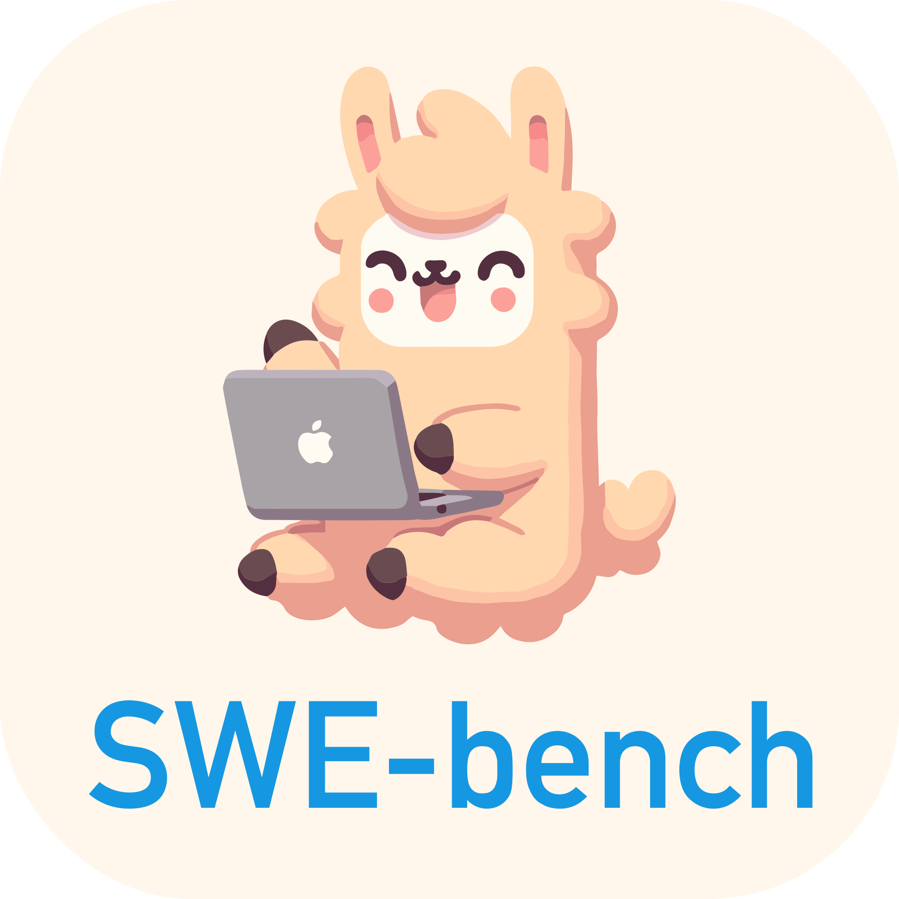
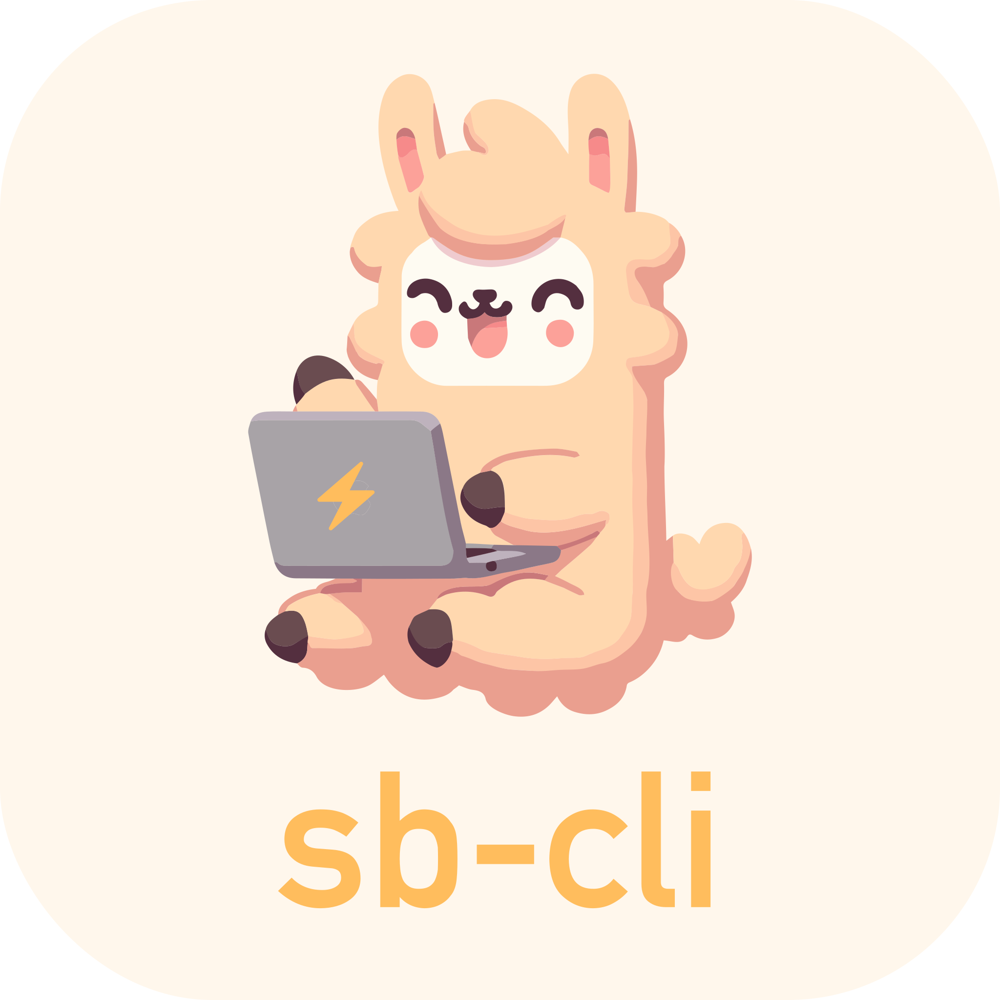

  

    
    &nbsp;&nbsp;
    
    &nbsp;&nbsp;
    
    &nbsp;&nbsp;
    
    &nbsp;&nbsp;
    
  

   
  
Software engineering agents, benchmarks, and models.

  
Built and maintained by researchers from Stanford University and Princeton University.

   
  

    
    
    
  

This organization contains the source code for several projects in the SWE-* open source ecosystem, including:
* [SWE-bench](https://swe-bench.github.io/), a benchmark for evaluating AI systems on real world GitHub issues.
* [SWE-agent](https://swe-agent.com/), a system that automatically solves GitHub issues using an LM agent.
* [SWE-smith](https://swe-smith.com/), a toolkit for generating SWE training data at scale.

Also check out the supporting infrastructure for working with SWE-* projects
* [SWE-ReX](https://github.com/SWE-agent/SWE-ReX), infrastructure supporting sandboxed code execution for AI agents
* [sb-cli](https://github.com/SWE-bench/sb-cli), a command line interface for running evaluations on the cloud.
* Mirror clones for the SWE-bench and SWE-smith repositories are available [here](https://github.com/SWE-bench-repos) and [here](https://github.com/orgs/swesmith/repositories).
